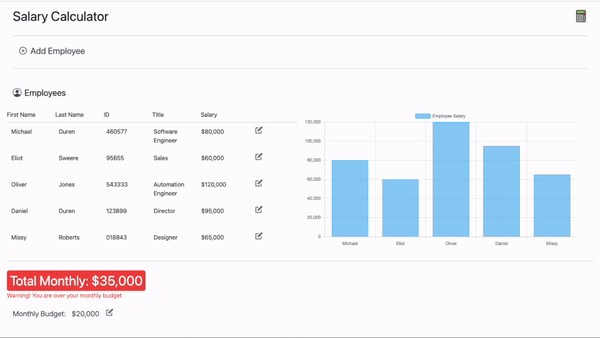

# Salary Calculator

Salary Calculator is a budgeting app for employees to keep track of their staff expenses. It includes a chart to represent which employees have the highest salaries.

## Demo



## Usage

### Structure

This repository contains two different projects.

- The first is in the client folder, and is a demo written using Vanilla JS. The demo stores employees in the application state, so employees will not persist after refreshing or leaving page.

- The second project uses the client-react folder and server folder. The server is written in .NET and includes a SQL Lite db to store employees. The client-react is written in React and has state that makes request to the .NET API to perform CRUD operations on the db of employees.

- Instructions to run each project are below

- There is a seed script in the `server` folder that will create employees in the database if the database is empty.

### Instructions

#### Clone the repository

```bash
git clone https://github.com/michael-duren/salary-calculator.git
```

#### Vainlla JS Demo (`/client`)

```bash
cd client/src
open index.html
```

#### React-.NET (`/server`)

##### .NET Setup

If you don't already have the .NET 7 SDK installed you can find the installer [here](https://dotnet.microsoft.com/en-us/download)
This project also includes the Swagger UI for testing the .NET API endpoints.

```bash
cd server/API

# the client app is being served on losthost:5145

# run with swagger UI
dotnet watch # this will open the Swagger UI and run the server

# run without swagger UI
dotnet run # this will just run the server
```

#### React Dev Server Setup

- If you want to run the Vite development server you can follow the instructions below.
- Vite dev server Port is 5173
- Must have npm installed

```bash
cd client-react
npm install
npm run dev
```
